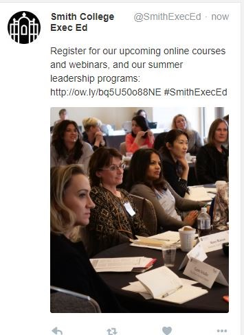
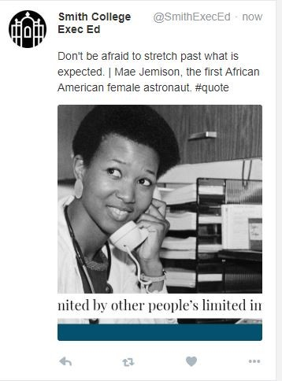
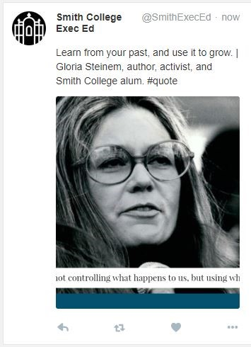
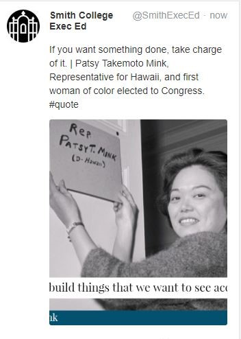

#Abstract

The goal of this study is to examine the impacts of content and time of posting on user engagement (the sum of the number of retweets, comments, and likes) with twitter posts on the Smith College Executive Education Office for Women Twitter Page. We found that morning posts showed a significantly higher level of engagement compared to afternoon posts. However, we found no evidence for both the main effect of the tweets content and the interaction effect between content and time of posting. Lack of data for promotional posts impacted our ability to have significant findings. Future research may be able to verify the time effects and to further explore the effect of day of the week.

#Introduction

Smith College Executive Education Office for Women was founded in 1975 with the purpose of providing unparalleled women’s leadership programs to women throughout the world. The office offers educational programs for professionals in all stages of their careers, intending to enhance leadership, negotiation, and strategic thinking skills, in partnership with Fortune 500 companies (Our History and Vision).

To expand outreach, the office is now active on all major social media platforms, including Facebook, Twitter, LinkedIn, and Instagram. Twitter is a social media microblogging platform that allows rapid exchange of information between individuals (Hawkins, Duszak, & Rawson, 2014). As one of the top 5 social media platforms, it still serves as an effective channel for promoting a brand. It is also helpful for maintaining meaningful connections with the office’s target audience (Barker, 2018). Therefore, Twitter can be a useful tool in achieving the outreaching goal of the Executive Office.

The Twitter page has 969 followers, and the posts show a relatively low level of engagement (receiving below 2 likes, retweets, and comments, on average). Given the benefits of Twitter, the goal of our study is to increase the engagement on the Smith College Executive Education Office Twitter page. Engagement is defined as the total number of times a user interacted with a tweet (Wadhwa, Devgan, Patel, Bourgeois, & Ahmed, 2018).  In our study, engagement was defined as the sum of retweets, likes, and comments. In the existing literature, researchers found that, for radiology journals, tweets published in the morning hours (06:00–11:59 hours) were twice as likely to have a high engagement rate compared with those published in the afternoon hours (12:00–16:59 hours). They also revealed certain types of tweets were more likely to have high engagement (Wadhwa, Latimer, Chatterjee, McCarty, & Fitzgerald, 2017). 

We wanted to investigate whether the findings could apply to the Smith College Executive Education Office. Specifically, we wanted to experimentally determine the impact of twitter post content and time of posting on engagement. User engagement is the key outcome of tweeting for individual users and organizations alike, as the increased level of engagement can help in the publicity of the center, which may eventually lead to more engagement in the center’s programs.

We intend to explore the following questions: What type of tweets get the most engagement?  What time of day is optimal for post engagement? Will the effect of content be different across the different times of the day?

We hypothesized that out of our three tweet types (inspirational, promotional, and informative) inspirational tweets would have the most engagement because followers may believe that they are the most interesting to their own Twitter followers. We also hypothesized that promotional posts would have the lowest engagement, as people may be hesitant to like or retweet these posts if they have not signed up for the event. We hypothesized that posts in the morning (8:30 am) would have more engagement than those in the afternoon (4:30 pm), given previous research. We wanted to explore if the interaction effect of Content X TimeofDay exists.


#Methods

## Study Design

This study has two factors of interest, time of day, and content type. Time of day has two levels, 8:30am, and 4:30pm. Content type has three levels, “promotional”, “inspirational”, and “informative”, referring to the most common types of tweets posted by the office. These two factors were crossed in our study.

Using 9 original posts, three of each content type, we created a Latin Square design over the span of three weeks. A Latin Square was chosen because we had two nuisance factors, day of the week, and week, both of which had three levels (Wednesday, Thursday, Friday, and Week of April 1st, week of April 8th, and week of April 15th, respectively). A Latin Square design allowed us to block by our two nuisance factors.

In order to randomize by the nuisance/blocking factors, we created three week layouts, each of which contained a different order of content type (ex. Week 1: Promotional, Inspirational, Informative). The three layouts were randomly assigned to each of the three weeks during which the study would run (the week of April 1st, the week of April 8th, and the week of April 15th). 

Our colleagues at the Office of Executive Education created three posts of each content type, one post of each type per week of the study. We were unable to randomly assign these posts to weeks because of the nature of events happening at the Exec Ed Office. Using HootSuite, a software for managing social media pages for organizations, we created a pre-planned schedule for posting each of the nine posts, based on the pre-decided schedule of the Latin Square. 

In order to add our second factor of interest, time of day, into the study, each post was posted twice within the same day, once at 8:30am and once at 4:30pm. This double-posting also allowed us to have replicates, which would later allow for ANOVA testing of the significance of day of week and week of the month.

## Analysis
Our experimental units were individual twitter posts, of which we had a total of 18. The outcome of interest was the number of likes, retweets, and comments 48 hours after posting. 48 hours after posting was the chosen time point of data collection because we believe it allowed enough time for users to see the posts, and any longer would not have significantly changed the engagement. Although we originally planned to conduct separate analyses on each type of engagement, total engagement levels remained too low. Therefore, total engagement (a sum of the number of likes, retweets, and comments on a tweet) was the only response variable used for the analysis. The mean total engagement per post was 0.78, indicating that most posts received fewer than one like, retweet, and comment. 

Several graphs, including side by side boxplots and an interaction graph, were employed as a means of informally analyzing the data. These graphs showed that one of the conditions, promotional posts, received no interaction. The promotional group therefore violated the assumptions of ANOVA (specifically the same standard deviation and normally distributed residuals assumptions). For this reason, the promotional posts were excluded from the formal analysis. It should be noted that this does not mean promotional posts should be ignored. Our finding that promotional posts received no engagement, while the other two content types did receive some engagement, indicates that promotional posts may be an area that the Exec Ed Office should focus on in order to increase overall engagement. 


# Assumptions testing 

Before analyzing the results, we first calculate the effects of all of our structural factors under the Fisher assumptions. The chunks of code below also calculate all of the pieces we'll need in our assembly line since the Fisher assumptions are built into the way we are calculating our assembly line instructions and when simulating the data below. The six Fisher assumptions we test include constant effects(C), same standard deviations (S), independent residuals (I), normally distributed residuals (N), and zero mean residuals (Z). The assumptions are tested before promotional type is excluded since it is part of our design.

Based on the discussions below, the assumptions about additive effects, standard deviations, and normally distributed residuals are violated.


```{r,echo=FALSE, warning=FALSE, message=FALSE, include = FALSE}
library(dplyr)
library(mosaic)
library(ggplot2)
library(readr)
library(tidyr)
library(tidyverse)
```

```{r,echo=FALSE, warning=FALSE, message=FALSE, include = FALSE}
df <- read_csv("data_twitter - Sheet2.csv")
```

```{r,echo=FALSE, warning=FALSE, message=FALSE, include = FALSE}
day <- c("Wed","Wed","Thurs","Thurs","Fri","Fri","Wed","Wed","Thurs","Thurs","Fri","Fri","Wed","Wed","Thurs","Thurs","Fri","Fri")
week <- c(rep("1", 6),                                  rep("2",6), rep("3",6))
df<-cbind(day,df)
df<-cbind(week,df)

```

```{r sum_engage,echo=FALSE, warning=FALSE, message=FALSE, include = FALSE}
df<-df%>%
  mutate(sum_engage=likes_48+retweets_48+comments_48)%>%
  unite(cell, time, type,remove=FALSE)
```


```{r}
df <- df%>%
  mutate(benchmark = mean(sum_engage)) #universal factor
```
```{r}
df <- df %>%
  group_by(type) %>%
  mutate(type_mean = mean(sum_engage),
         type_effect = type_mean - benchmark) 
#for each level of type factor
print(df$type_effect)
```
```{r}
df <- df %>%
  group_by(week) %>%
  mutate(week_mean = mean(sum_engage),
         week_effect = week_mean - benchmark) 
#for each level of type factor
print(df$week_effect)
```

```{r}
df <- df %>%
  group_by(day) %>%
  mutate(day_mean = mean(sum_engage),
         day_effect = day_mean - benchmark) 
#for each level of type factor
print(df$day_effect)
```

```{r}
df <- df %>%
  group_by(time) %>%
  mutate(time_mean = mean(sum_engage),
         time_effect = time_mean - benchmark) 
#for each level of type factor
print(df$time_effect)
```

```{r}
df <- df %>%
  group_by(cell) %>%
  mutate(cell_mean = mean(sum_engage),
         interaction_effect = cell_mean - (type_mean + time_mean - benchmark)) #for each cell of interaction
print(df$interaction_effect)
```


C: From above, we could see that the assumption of constant effects (C) is not violated since very observation in a similar condition is affected exactly the same. For example, the type effects for three levels of the type factors are the same.

```{r}
df<- df %>%
  ungroup() %>%
  mutate(residuals = sum_engage - (benchmark 
                             + type_effect 
                             + time_effect 
                             + interaction_effect
                             + day_effect
                             + week_effect)
                             )%>% #universal factor
  select(-type_mean, -time_mean, 
         -cell_mean, -day_mean, -week_mean) #removing the stuff we don't need
```

A: The pieces that go together to make the observed value should be combined by adding them, so we add the effects as we go down the assembly line. As you can see from the chunk of codes above, the predicted sum level of engagement is obtained by adding up benchmark and all the effects of predictor variables.  

S: There should be one standard deviation for all the errors, so the piece of code for adding error is not dependent on which condition the observations is in. We consider this assumption violated if the SD of the biggest group is more than three times as big as the SD of the smallest group. According to the tables below, SDmax = 1.15 < 3*SDmin = 0, so this assumption is violated. Since the SD is zero only for promotional type of posts, we decide to exclude this type from the data in the results section.

```{r}
favstats(sum_engage ~time+type, data=df)
```

```{r}
favstats(sum_engage ~type , data=df)
```

```{r}
favstats(sum_engage ~time , data=df)
```

I: To check for independence in the residuals, we will test the assumption by plotting residuals against a time variables present (e.g., order of observation). A pattern that is not random suggests lack of independence. However, There is no observable pattern according to the graph below, so the Independence assumption is not violated. In addition, we randomly assign posts to each time and type condition, so the residuals are independent from each other.


```{r}
df2 <- df2%>%
  mutate(residuals = residuals(twitter),
         SD = sd(residuals))
         
ggplot(df2, aes(x = residuals)) +
  geom_histogram(bins = 10) +
  geom_vline(aes(xintercept = SD), color = "blue") +
  geom_vline(aes(xintercept = -SD), color = "blue")

```


N: The distribution of error sizes should follow a normal curve. According to the histogram above, this assumption is violated since the histogram does not have a bell shape and we have no observation for the promotional type of post. 


```{r}

qqnorm(twitter$residuals)
```


Z: The average of the tickets in the error box should be zero. This means that the average of a set of observed values should tend to fall near the underlying true value. According to the graph, the average of the tickets in the error box is zero. Whenever we substract the average from a set of numbers, the leftover from the average will add to zero. Z is valid.

the mean residual is not zero but is really really close to zero so this assumption roughly holds since the dots are clustering around zero.


#Results

In this section, we summarize the data collected and discuss the results of the informal analysis and the analysis of variance. We start by presenting the summary statistics of the data sets, analyzing each graph, and then proceed to test our hypothesis by analyzing the relationships among variables based on the anova table.

##Summary statistics

```{r,echo=FALSE, warning=FALSE, message=FALSE, include = FALSE}
library(tidyverse)
df2<-as.data.frame(df)%>%
  na.omit()%>%
  select(sum_engage,likes_48,retweets_48,comments_48,type)
```

```{r,echo=FALSE, warning=FALSE, message=FALSE, include = FALSE}
library(stargazer)
stargazer(data = df2, type = "html", title="Summary statistics of DV", digits=2, out="tablesum.html",covariate.labels = c("Total Engagement","#Likes","#Retweets","#Comments","type"))

```

```{r, out.width='70%', fig.align='center', include = TRUE, echo = FALSE}
knitr::include_graphics('sum.png')
```


According to the summary statistics table, we only collect 18 observations in total and the amount of engagement might be too small to be informative and statistically meaningful. The mean amount of engagement is less than one (mean = 0.78)

##Informal Analysis

Before conducting a formal analysis, we arrange a side by side boxplot and an interaction graph with the categories on the horizontal axis of the display to allow comparison between the different categories as well as comparison within categories.

###Side by side boxplot


```{r,echo=FALSE, warning=FALSE, message=FALSE, include = TRUE}
#looking at variability by condition
ggplot(df, aes(x = type, fill = time, y = sum_engage)) +
  geom_boxplot()

```


The side by side boxplot above tells us that there may be a main effect of time of day (morning posts seem to get more engagement than afternoon posts) since green boxes are above red boxes regardless of post types. In addition, there may be a main effect of post content (promotional posts get less engagement than informative and inspirational posts) since both the green box and red box of the inspirational type are high than those of the informative type.

##Interaction effects

The interaction graph indicates that first, there may be an interaction between type and time when the promotional type is included since the line of promotional posts is not parallel with the other two lines. Second, there is no interaction between type and time when the promotional type is excluded since the line of inspirational posts an the line of informative posts are parallel with each other. Third, there may be a main effect of time of the day since the lines of inspirational and informative posts are upward sloping.


```{r echo=FALSE, warning=FALSE, message=FALSE, include = TRUE}
ggplot(df, aes(x = time, 
                    y = sum_engage, 
                    color = type,
                    group = type)) +
  geom_point(size = 2) +
  geom_smooth(method = "lm", se = 0)
```


##ANOVA

To look more deeply into the impacts of these variables on the amount of people's engagement on twitter and add more control variables, we conduct the analysis of variance (ANOVA) to decide if the effects of these variables are real. Since our assumptions about residuals (Same SD and Normally Distributed Residuals) are violated by the promotional group, we exclude this group from our formal ANOVA.


```{r,echo=FALSE, warning=FALSE, message=FALSE, include = FALSE}
df2<-df%>%
  filter(type =="informative"| type =="inspirational")
```

```{r,echo=FALSE, warning=FALSE, message=FALSE, include = TRUE}
twitter <- aov(sum_engage ~ type+time+day+week+type*time, data = df2)

anova1<-anova(twitter)
summary(twitter)
```

```{r,echo=FALSE, warning=FALSE, message=FALSE, include = FALSE}
is.num <- sapply(anova1, is.numeric)
anova1[is.num] <- lapply(anova1[is.num], round, 3)
anova1[4,5]<-"0.250"
anova1[1,5]<-"0.230"
anova1[1,6]<-""
anova1[2,6]<-"*"
anova1[3,6]<-"*"
anova1[4,6]<-" "
anova1[5,6]<-" "
anova1[6,6]<-" "
anova1[6,5]<-" "
anova1[6,4]<-" "
anova2<-anova1[1:6,]

```

```{r,echo=FALSE, warning=FALSE, message=FALSE, include =TRUE}
library(kableExtra)
kable(anova2, digits = 3, format = "html", booktabs = T,col.names = c("Df","Sum Sq","Mean Sq","F value"," Pr(>F)"," "))%>%
  kable_styling(full_width = F, font_size = 12)%>%add_footnote("Signif. codes:  0 ‘***’ 0.001 ‘**’ 0.01 ‘*’ 0.05 ‘.’ 0.1 ‘ ’ 1", notation="alphabet")%>%column_spec(1, width = "5em") 
```


Excluding promotional posts, we could see from the table above that there is not a significant main effect of post type (p=0.23) on the level of engagement. The interaction graph and ANOVA table (excluding promotional posts) indicate the interaction effect of type and time is not statistically significant (p=1). However, the anova shows that time of posting is significantly associated with engagement (p=0.047) as shown on the parallel box-plot. Specifically, morning posts obtain more engagements than afternoon posts. 

Moreover, the ANOVA table also indicates a statistically significant effect of day of the week (p=0.016) on the amount of engagement with the posts. Upon closer inspection, however, we see that Thursdays have no engagement and the most amount of engagement occur on Wednesday. This may indicate that people are more active on Wednesday, following by Friday and Thursday. However, the significance of this finding may not be valid, given that no engagement for one group violates the assumptions for residuals.

```{r}
# confint(twitter)
# 
# sdpooled.calc <- sqrt(anova(twitter)["Residuals", "Mean Sq"]) 
# mcalc <- mean(df2$sum_engage) 
# ncalc <- length(df2$sum_engage) 
# t.crit <- qt(p = .05/2, df = 12, lower.tail=FALSE) 
# 
# #then if memory serves the CI for means formula is 
# 
# mcalc - ((t.crit * sdpooled.calc)/sqrt(ncalc)) 
# mcalc + ((t.crit * sdpooled.calc)/sqrt(ncalc)) 

```


In a word, only the second hypothesis that posts in the morning (8:30 am) would have more engagement than those in the afternoon (4:30 pm) is supported by the current result. The impact of type of post and its interaction with time of day are not statistically significant. Nevertheless, the significance of the current findings is worth more investigation since the amount of data collected by the current study is insufficient. 

#Discussion and Conclusion

Tweets posted in the mornings (8:30am) were found to have significantly higher engagement than tweets posted in the afternoon (4:30pm). Twitter users may be more active on the site earlier in the day, or their twitter feeds may get busier during the day, causing afternoon tweets to get less engagement. This finding, however, must be taken in light of the limitation of double posting. Each post was posted twice within a given day, therefore, users may have seen the earlier post, rendering them less likely to engage with the later post. Further research should include replicates to verify the effect of time.

The ANOVA did not find a significant difference between content types (informative and inspirational). Promotional posts, which were excluded from the ANOVA for violation of assumptions, received no engagement. While the statistical significance of this finding cannot be ascertained due to no variance, this finding may have practical significance. The office may wish to investigate promotional posts further, perhaps exploring ways to integrate informative and inspirational elements into promotional posts to boost engagement. The office may also wish to explore the relationship between promotional post engagement and event attendance in order to ascertain the importance of promotional post engagement for the office’s success.
The finding of an effect of day of the week should also be explored further. As this was not the main focus of this study, and one of the days received no engagement, we cannot make conclusions about this effect at this time. 

This study should be taken in light of its limitations. The primary limitations are the small sample size and lack of replicates. Using the same post twice limits our ability to conclude the significance of the time of day finding. Future studies may wish to replicate the experiment and potentially use 18 different posts, instead of posting the same 9 posts twice. 


#Reference
Barker, S. (2018, August 13). Why Twitter Engagement Is Essential for Brands Today. Retrieved from https://sproutsocial.com/insights/twitter-engagement/

Ed, S. C. (2019, April 30). Smith College Exec Ed (@SmithExecEd). Retrieved from https://twitter.com/SmithExecEd

Hawkins, C. M., Duszak, R., & Rawson, J. V. (2014). Social media in radiology: early trends in Twitter microblogging at radiology's largest international meeting. Journal of the American College of Radiology, 11(4), 387-390.

Our History and Vision. (n.d.). Retrieved from https://execed.smith.edu/our-history-and-vision

Wadhwa, V., Devgan, A., Patel, M. V., Bourgeois, A. C., & Ahmed, O. (2018). Factors Increasing Tweet Engagement Rate for the Journal of Vascular and Interventional Radiology Twitter Feed. Journal of Vascular and Interventional Radiology, 29(7), 1057-1059.

Wadhwa, V., Latimer, E., Chatterjee, K., McCarty, J., & Fitzgerald, R. T. (2017). Maximizing the tweet engagement rate in academia: analysis of the AJNR Twitter feed. American Journal of Neuroradiology, 38(10), 1866-1868.


#Appendix


{ width=40% }


{ width=40% }


{ width=40% }


{ width=40% }


{ width=40% }


{ width=40% }


{ width=40% }

{ width=40% }


{ width=40% }


