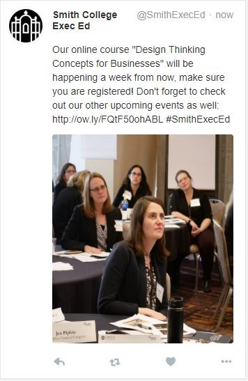

#Abstract


#Introduction

We are trying to increase the engagement on the Smith College Executive Education Office twitter page. Specifically, we want to explore what kinds of content and ways of presenting content could increase the number of likes and retweets. More likes and retweets are important for the publicity of the center, which may eventually lead to more engagement in the center’s programming.

We intend to explore the following questions: What type of tweets get the most engagement? What type of tweets are most retweeted? What type of tweets receives the most likes? What time of day is optimal for post engagement?

We hypothesized that tweets that are inspirational will have the most retweets because followers may believe that they are the most interesting to their own twitter followers. We also hypothesized that promotional posts will have the lowest engagement. We hypothesized that posts in the morning (8:30am) will have more engagement because people may be commuting at that time, and those tweets may remain visible during the work day and lunch hour. We wanted to explore if the interaction effect (Content X TimeofDay) exists.


#Method

This study is a Latin Square design. The two factors of interest, type of post and time of posting, are crossed. 

We use 9 original posts. Each post will be posted twice, once at 8:30am and once at 4:30pm on the same day, making time slot a within block factor.

We design the Latin square by creating week layouts and randomly assigning each of the layouts to one of the three weeks of our study. We then randomly assign post type (treatment) to each of the three letters (A, B, and C). After that, the interns at the office add each post on twitter based on the pre-decided schedule. 

--------------------------------------------------------------------------------------------------------------
{width=100% } 
A= inspirational morning post a = inspirational afternoon post; 
B= informative morning post b = informative afternoon post; 
C= promotional morning post c = promotional afternoon post

--------------------------------------------------------------------------------------------------------------


The next step is to add up the number of likes and retweets 48 hours later to measure readers’ level of engagement. The time period after which engagement is measured is constant among the posts.

After wrapping up the experiment, we calculate the averages to compare the overall difference between types of posts, day of week, and time of day. 

The Executive Education Assistants created the content in advance of the study, and they contacted Jill directly for approval. 

Below is a preview of the posts:

Week1:
April 3rd- Informative

{ width=40% }


April 4th- Promotional
{ width=40% }


April 5th- Inspirational
{ width=40% }

Week2:
April 10th- Inspirational

{ width=40% }

April 11th- Informative

{ width=40% }

April 12th- Promotional
{ width=40% }
Week3:
April 17th- Promotional

{ width=70% }
April 18th- Inspirational
{ width=70% }
April 19th- Informative

{ width=70% }


#Results

##summary statistics

```{r,echo=FALSE, warning=FALSE, message=FALSE, include = FALSE}
library(dplyr)
library(mosaic)
library(ggplot2)
library(readr)
library(tidyr)
library(tidyverse)
```

```{r,echo=FALSE, warning=FALSE, message=FALSE, include = FALSE}
df <- read_csv("data_twitter - Sheet2.csv")
```

```{r,echo=FALSE, warning=FALSE, message=FALSE, include = FALSE}
day <- c("Wed","Wed","Thurs","Thurs","Fri","Fri","Wed","Wed","Thurs","Thurs","Fri","Fri","Wed","Wed","Thurs","Thurs","Fri","Fri")
week <- c(rep("1", 6),                                  rep("2",6), rep("3",6))
df<-cbind(day,df)
df<-cbind(week,df)

```

```{r sum_engage,echo=FALSE, warning=FALSE, message=FALSE, include = FALSE}
df<-df%>%
  mutate(sum_engage=likes_48+retweets_48+comments_48)%>%
  unite(cell, time, type,remove=FALSE)

```

```{r,echo=FALSE, warning=FALSE, message=FALSE, include = FALSE}
library(tidyverse)
df2<-as.data.frame(df)%>%
  na.omit()%>%
  select(sum_engage,likes_48,retweets_48,comments_48,type)
```

```{r,echo=FALSE, warning=FALSE, message=FALSE, include = TRUE}
library(stargazer)
stargazer(data = df2, type = "text", title="Summary statistics of DV", digits=2, out="tablesum.html",covariate.labels = c("Total Engagement","#Likes","#Retweets","#Comments","type"))

```

According to the summary statistics table, we only collect 18 observations in total and the amount of engagement might be too small to be informative and statistically meaningful. The mean amount of engagement is less than one (mean = 0.78)


##Informal Analysis

Before conducting a formal analysis, we arrange a side by side boxplot and an interaction graph towith the categories either on the horizontal axis of the display to allow comparising between the different categories as well as comparison within categories.

###Side by side boxplot

```{r,echo=FALSE, warning=FALSE, message=FALSE, include = TRUE}
#looking at variability by condition
ggplot(df, aes(x = type, fill = time, y = sum_engage)) +
  geom_boxplot()

```

The side by side boxpot above tells us that there may be a main effect of time of day (morning posts seem to get more engagement than afternoon posts), and a main effect of post content (promotional posts get less engagement than informative and inspirational posts).


###Parallel dot graph

```{r,echo=FALSE, warning=FALSE, message=FALSE, include = TRUE}
#looking at variability by condition
ggplot(df, aes(x = type, color = time, y = sum_engage)) +
    geom_jitter(height = 0.10, width = 0.05, alpha = .7)
```

##Interaction effects

```{r,echo=FALSE, warning=FALSE, message=FALSE, include = TRUE}
ggplot(df, aes(x = type, 
                    y = sum_engage, 
                    color = time,
                    group = time)) +
  geom_point(size = 2) +
  geom_smooth(method = "lm", se = 0)
```

The interaction graph indicates that first, there may be an interaction between type and time when the promotional type is included sinc the line of promotional posts is not parallel with the other two lines. Second, there is no interaction between type and time when the promotional type is excluded since the line of inspirational posts an the line of informative posts are parallel with each other. Third, there is a main effect of time of the day since the lines of inspirational and informative posts are upward sloping.

```{r echo=FALSE, warning=FALSE, message=FALSE, include = TRUE}
ggplot(df, aes(x = time, 
                    y = sum_engage, 
                    color = type,
                    group = type)) +
  geom_point(size = 2) +
  geom_smooth(method = "lm", se = 0)
```


##ANOVA

To look more deeply into the impacts of these variables on the amount of people's engagement on twitter, we conduct the analysis of variance to decide if the effects of these variables are real. Since our assumptions about residuals (Same SD and Normally Distributed Residuals) are violated by the promotional group, We  excluded this group from our formal ANOVA.


```{r,echo=FALSE, warning=FALSE, message=FALSE, include = FALSE}
df2<-df%>%
  filter(type =="informative"| type =="inspirational")
```

```{r,echo=FALSE, warning=FALSE, message=FALSE, include = TRUE}
twitter <- aov(sum_engage ~ type+time+day+week+type*time, data = df2)

anova1<-anova(twitter)
summary(twitter)

#favstats(sum_engage~type|time, data = df2)

# library(mosaic)
# tally(~time|as.character(type), data = df2)
# 
# df2$type
```


```{r,echo=FALSE, warning=FALSE, message=FALSE, include = FALSE}
is.num <- sapply(anova1, is.numeric)
anova1[is.num] <- lapply(anova1[is.num], round, 3)
anova1[4,5]<-"0.250"
anova1[1,5]<-"0.230"
anova1[1,6]<-""
anova1[2,6]<-"*"
anova1[3,6]<-"*"
anova1[4,6]<-" "
anova1[5,6]<-" "
anova1[6,6]<-" "
anova1[6,5]<-" "
anova1[6,4]<-" "
anova2<-anova1[1:6,]

```

```{r,echo=FALSE, warning=FALSE, message=FALSE, include =TRUE}
library(kableExtra)
kable(anova2, digits = 3, format = "html", booktabs = T,col.names = c("Df","Sum Sq","Mean Sq","F value"," Pr(>F)"," "))%>%
  kable_styling(full_width = F, font_size = 12)%>%add_footnote("Signif. codes:  0 ‘***’ 0.001 ‘**’ 0.01 ‘*’ 0.05 ‘.’ 0.1 ‘ ’ 1", notation="alphabet")%>%column_spec(1, width = "5em") 
```

Excluding promotional posts, we could see from the table above that there is not a significant main effect of post type. Interaction between type and time was not significant as well. However, time of posting is significantly associated with engagement. Specifically, morning posts obtain more engagements than afternoon posts. 

In a word, the parallel box-plot and ANOVA indicate the statistically significant main effects of time of day (p=0.047). Excluding promotional posts, there is not a significant main effect of post type (p=0.23). The interaction graph and ANOVA table (excluding promotional posts) indicate the interaction effect of type and time is not statistically significant (p=1).  


#Conclusion